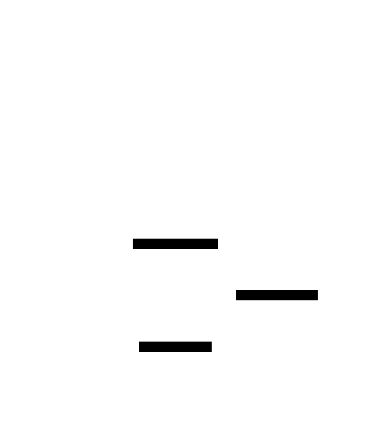
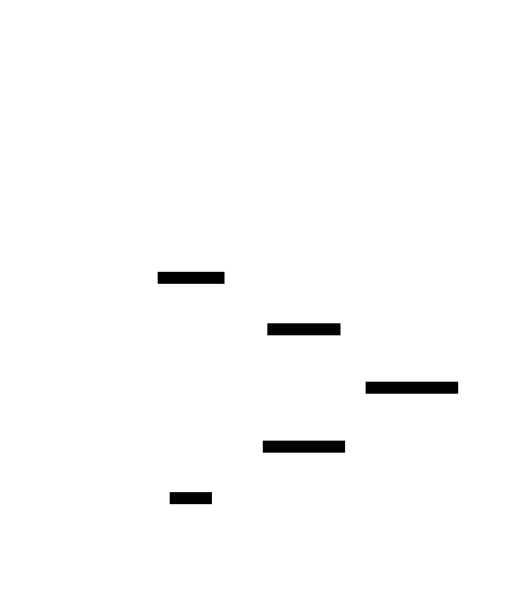

ifndef::imagesdir[:imagesdir: ../images]

[[section-runtime-view]]
== Runtime View

ifdef::arc42help[]
[role="arc42help"]
****
.Contents
The runtime view describes concrete behavior and interactions of the system’s building blocks in form of scenarios from the following areas:

* important use cases or features: how do building blocks execute them?
* interactions at critical external interfaces: how do building blocks cooperate with users and neighboring systems?
* operation and administration: launch, start-up, stop
* error and exception scenarios

Remark: The main criterion for the choice of possible scenarios (sequences, workflows) is their *architectural relevance*. It is *not* important to describe a large number of scenarios. You should rather document a representative selection.

.Motivation
You should understand how (instances of) building blocks of your system perform their job and communicate at runtime.
You will mainly capture scenarios in your documentation to communicate your architecture to stakeholders that are less willing or able to read and understand the static models (building block view, deployment view).

.Form
There are many notations for describing scenarios, e.g.

* numbered list of steps (in natural language)
* activity diagrams or flow charts
* sequence diagrams
* BPMN or EPCs (event process chains)
* state machines
* ...

.Further Information

See https://docs.arc42.org/section-6/[Runtime View] in the arc42 documentation.

****
endif::arc42help[]

The runtime view describes the behaviour and interactions of the system's building blocks through selected scenarios. It captures how the TypeScript Web Application and the Rust Module cooperate to fulfill the requirements.

=== Human vs Computer Match 
This scenario references the high-level requirement: _Classic version of Game Y, player-vs-machine mode._ 
It covers the logic when a human player makes a move on the board.

==== Quality Context
[cols="1,3"]
|===
| **Source** | Human Player
| **Stimulus** | Selects a position on the board via the Web Frontend
| **Artifact** | System (Web App + Rust Module)
| **Environment** | Normal operation
| **Response** | The move is validated, if the game ends the result is persisted, and the board is updated
| **Response Measure** | The UI reflects the new state in less than 0.5 seconds
|===

==== Interaction sequence
image::../images/human_computer.svg[alt="Registration Sequence", width=600, align="center"]

*1.* User selects a position on the board via the Web Frontend.

*2.* Web Application (TypeScript) sends a JSON message in YEN notation to the Rust Module to verify the move.

*3.* Rust Module verifies if the move is valid and if the match has ended.

*4.* Rust Module returns the result (Move valid/Match won/Match continues) to the Web Application.

*5.* If the game ended the Web Application updates the game state in the MariaDB database and reflects the new state in the Web Frontend anyways.

=== User Registration and History Consultation

This scenario references the high-level requirement: _Users will be able to register and consult participation history._ 
It describes how a user interacts with the system to manage their profile and view their match history.

==== Quality Context
[cols="1,3"]
|===
| **Source** | Human Player
| **Stimulus** | Provides registration details via the Web Frontend
| **Artifact** | System (Web App)
| **Environment** | Normal operation
| **Response** | Redirects the user to the game app and allows to view the match history
| **Response Measure** | The UI reflects the new state in less than 0.5 seconds
|===

==== Interaction sequence

[cols="a,a", frame=none, grid=none]
|===
| image::../images/registration.svg[title="User registration", width=100%]
| image::../images/history.svg[title="History consultation", width=100%]
|===

*1.* User provides registration details through the Web Frontend.

*2.* Web Application (TypeScript) receives the request and validates the information with the data on the MariaDB database.

*3.* When the registered User requests their history, the Web Application queries the MariaDB database for the raw data.

*4.* The Web Application then calculates the history metrics and returns them to the Web Frontend for rendering.

=== Computer Strategy Execution 
This scenario references the high-level requirement: _The game against the computer must implement more than one strategy._ 
It describes how the system suggests of executes a move for the computer.

==== Quality Context
[cols="1,3"]
|===
| **Source** | Human Player
| **Stimulus** | Provides a computer difficulty level via the Web Frontend
| **Artifact** | System (Web App + Rust Module)
| **Environment** | Normal operation
| **Response** | The GameEngine works with the strategy according to the difficulty level chosen
| **Response Measure** | The UI reflects the new state in less than 1 seconds
|===

==== Interaction sequence

*1.* Web Application (TypeScript) triggers a request for a computer move based on the user-selected difficulty/strategy.

*2.* The request is sent to the Rust Module containing the current board state in YEN notation.

*3.* Rust Module invokes the selected strategy algorithm to calculate the next move.

*4.* Rust Module suggests the next move via its Web Service Interface.

*5.* Web Application receives the move and performs the action.

=== External Bot Interaction
This scenario references the high-level requirement: _API will enable a bot to play... a 'play' method will be exposed._ 
It describes the interaction of an external bot with the YOVI system.

==== Quality Context
[cols="1,3"]
|===
| **Source** | External Bot
| **Stimulus** | Invokes the API 'play' method providing a 'boardState' in YEN notation
| **Artifact** | System (Web App + Rust Module)
| **Environment** | Normal operation
| **Response** | The system validates the input, processes game logic via the Rust module, and returns the result
| **Response Measure** | The API returns the next move in YEN notation in less than 1 seconds
|===

==== Interaction sequence

*1.* External Bot calls the 'play' method on the External API (Web Application).

*2.* The request includes a 'boardState' parameter, the board state in YEN notation.

*3.* Web Application forwards the state to the Rust Module for the best's move calculation.

*4.* Rust Module returns the updated state/result to the Web Application.

*5.* Web Application returns the next move to the External Bot using YEN notation.

